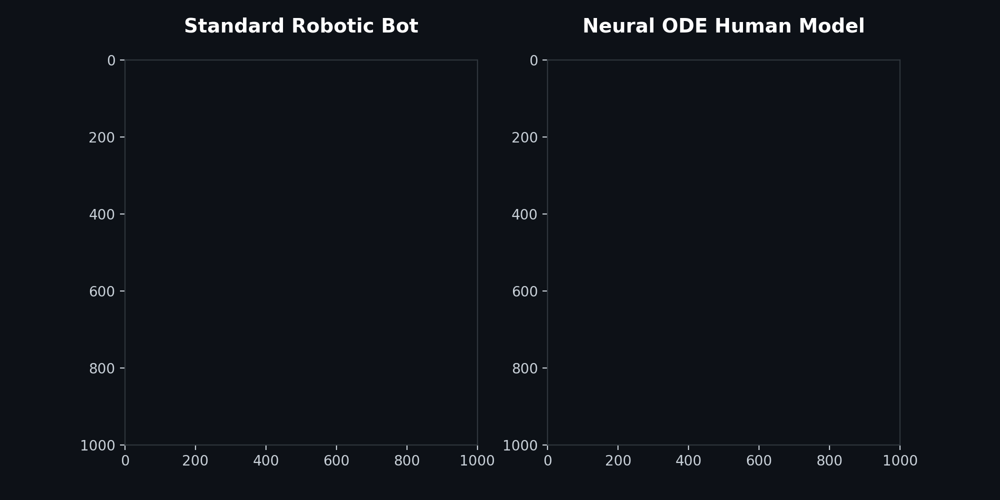
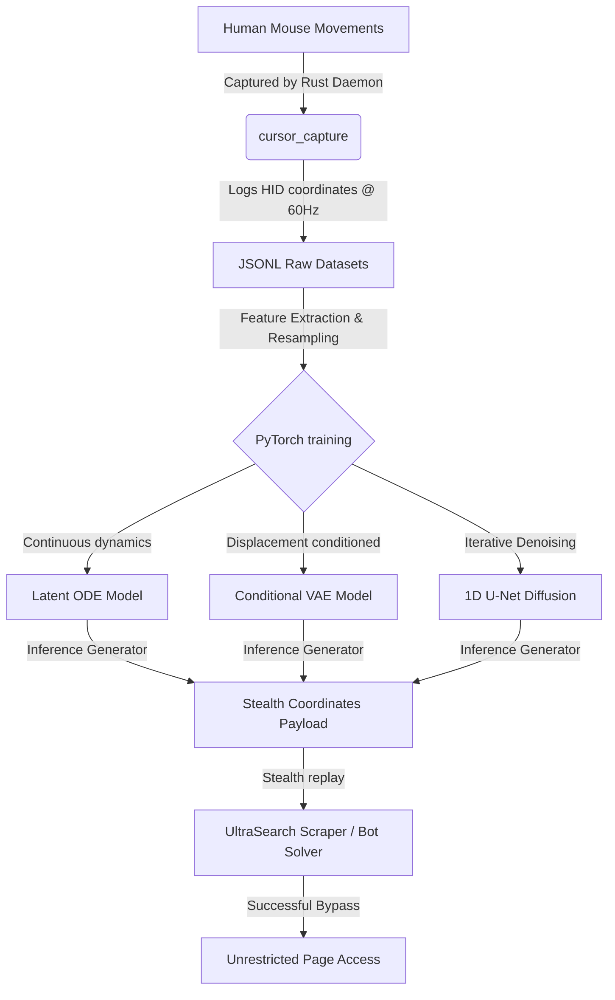

<div align="center">
  <h1 style="font-family: 'Outfit', sans-serif; font-size: 2.75em; font-weight: 800; background: linear-gradient(120deg, #6366F1, #A855F7, #EC4899); -webkit-background-clip: text; -webkit-text-fill-color: transparent;">🧠 Human Mouse Trajectory ML Engine</h1>
  <p><b>Advanced Biological Mimicry & High-Fidelity Cursor Path Generation using Neural ODEs, CVAEs, and Diffusion Models</b></p>

  <div>
    
    
    
    
    
  </div>
  
  <br/>
  
  <h4>Generating indistinguishable, human-like mouse trajectories to bypass behavioral bot detection mechanisms (Cloudflare Turnstile, DataDome, reCAPTCHA v3, Akamai).</h4>
</div>

<br/>

---

## 📖 Table of Contents
- [🎯 What is it?](#-what-is-it)
- [⚡ Why do we need this? (The Science of Anti-Bot)](#-why-do-we-need-this-the-science-of-anti-bot)
- [🏗️ How It Works (End-to-End Pipeline)](#️-how-it-works-end-to-end-pipeline)
- [🧠 Generative Models Deep-Dive](#-generative-models-deep-dive)
  - [1. Latent Ordinary Differential Equations](#1-latent-ordinary-differential-equations)
  - [2. Conditional Variational Autoencoders](#2-conditional-variational-autoencoders)
  - [3. Denoising Diffusion Probabilistic Models (DDPM)](#3-denoising-diffusion-probabilistic-models-ddpm)
- [📊 Model Comparison Matrix](#-model-comparison-matrix)
- [⚙️ Setup & Installation](#️-setup--installation)
  - [1. Build the Rust Capture Daemon](#1-build-the-rust-capture-daemon)
  - [2. Python Environment Setup](#2-python-environment-setup)
  - [3. Training & Trajectory Generation](#3-training--trajectory-generation)
- [🔌 Sister Project: UltraSearch Integration](#-sister-project-ultrasearch-integration)
- [🛡️ Ethical Use & Disclaimer](#️-ethical-use--disclaimer)

---

## 🎯 What is it?

The **Human Mouse Trajectory ML Engine** (v2.01) is a state-of-the-art deep learning research and implementation framework designed to capture, model, and generate human-like mouse movements. 

By training deep generative networks on raw human input, the engine generates mouse paths that replicate the precise physics of human hand-eye coordination—including custom velocity profiles, acceleration arcs, muscle micro-tremors, correction loops, and click latencies.

These generated paths are engineered to bypass advanced **behavioral bot detection heuristics** that analyze pointer physical dynamics to identify automated browsers (like Playwright, Puppeteer, or Selenium).

> 💡 **Active Application:** These mouse models are natively integrated into **[UltraSearch (v2.01)](https://github.com/Ramcharan747/UltraSearch)**, a local Tavily alternative for AI agents that executes stealth web scraping and search.

---

## 🎯 Visual Proof: Bot vs Neural ODE Mimicry



*Standard automated paths are easily flagged by heuristic bot-detection mechanisms (Cloudflare, Datadome, Kasada). Our Neural ODE model mathematically generates human-like acceleration curves, hesitation, and natural jitter.*


## ⚡ Why do we need this? (The Science of Anti-Bot)

Web security has evolved from static browser fingerprinting (checking WebGL, Canvas, User-Agents) to **Dynamic Behavioral Analysis**. When automation libraries move the mouse, their paths are dead giveaways to security scripts:

* **Linear Trajectories:** Moving directly from point $A$ to point $B$ in a straight line:
  $$x(t) = x_0 + t \cdot \Delta x, \quad y(t) = y_0 + t \cdot \Delta y$$
* **Simple Bezier Interpolation:** While curved, standard Bezier curves lack the physical noise, micro-adjustments, and muscle friction of a human hand.
* **Instantaneous Teleportation:** Jumping coordinates instantly without intermediary time-steps.

```
Linear (Bot)            Bezier (Simple)          Biological (Human / Engine)
A ─────────────────→ B  A ╭─────────────────╮ B  A ╭─~~\~~╭─~~\───~ B
                        ╰─────────────────╯        (Muscle micro-tremors &
                                                    physical acceleration)
```

Modern anti-bot engines (like **Cloudflare Turnstile, DataDome, and reCAPTCHA v3**) capture cursor coordinates at the OS/browser level and compute higher-order physical derivatives:
1. **Velocity ($v$):** $v(t) = \sqrt{\dot{x}(t)^2 + \dot{y}(t)^2}$
2. **Acceleration ($a$):** $a(t) = \frac{dv}{dt}$
3. **Jerk ($j$):** $j(t) = \frac{da}{dt}$ (rate of change of acceleration)

If these curves are mathematically perfect, the session is flagged as automated. This project captures **real human muscle noise** and models it using continuous and discrete generative networks to create trajectories that anti-bot heuristics cannot distinguish from a real human.

---

## 🏗️ How It Works (End-to-End Pipeline)

The overall system architecture spans high-performance OS-level data data capture, training of deep generative models, and integration into automation frameworks:



---

## 🧠 Generative Models Deep-Dive

We implement three distinct generative approaches within the `trajectory_gen/models/` directory:

### 1. Latent Ordinary Differential Equations (`latent_ode.py`)
Treats the mouse path as a continuous-time trajectory defined by a neural network parameterizing a system of differential equations:
$$\frac{dz}{dt} = f_\theta(z(t), t)$$
* **Architecture:** Combines an **ODE-RNN encoder** (running backward in time to capture user intent) with a generative ODE solver (**Runge-Kutta 4/5 - dopri5**) that integrates latent dynamics.
* **Best For:** Irregularly-sampled time steps and continuous physical kinematics.

### 2. Conditional Variational Autoencoders (`cvae.py`)
A fast, lightweight model conditioned on the target displacement vector $(\Delta x, \Delta y)$:
* **Architecture:** The encoder uses 1D Convolutional Residual Blocks to compress trajectory shapes into a compact latent space. The decoder takes a sampled latent vector paired with the target displacement to reconstruct the target path.
* **Best For:** Instantaneous, low-latency trajectory generation.

### 3. Denoising Diffusion Probabilistic Models (DDPM) (`diffusion.py`)
Generates highly realistic trajectories by iteratively refining a sequence starting from pure Gaussian noise:
* **Architecture:** Uses a 1D U-Net with skip connections, conditioned on time-step embeddings and target coordinates.
* **Best For:** Capturing complex human behaviors like target overshoot, search patterns, and minor cursor adjustments.
* **Zero-Latency Affine Warping:** Includes an $O(1)$ affine scaling solver (`warp_trajectory`) to instantly stretch and rotate generated paths to fit any start/end coordinate without real-time neural network inference.

---

## 📊 Model Comparison Matrix

| Model | Generation Speed | Realism Score | Adaptability | Resource Usage | Primary Use Case |
| :--- | :--- | :--- | :--- | :--- | :--- |
| **Latent ODE** | Moderate (~250ms) | ⭐⭐⭐⭐⭐ | Excellent (Continuous) | High | Complex, multi-stage human tasks |
| **CVAE** | Ultra-Fast (<5ms) | ⭐⭐⭐ | Good (Conditioned) | Very Low | High-throughput scraping (T1/T2) |
| **Diffusion (DDPM)** | Slow (~800ms) | ⭐⭐⭐⭐⭐ | Exceptional | Moderate | Heavy CAPTCHA/Turnstile challenges (T3) |

---

## ⚙️ Setup & Installation

### 1. Build the Rust Capture Daemon (`cursor_capture/`)
The daemon runs quietly in the background, logging mouse movements to construct your custom training dataset.
```bash
# Clone the repository
git clone https://github.com/Ramcharan747/Cursor-tragectory.git
cd Cursor-tragectory/cursor_capture

# Build for release
cargo build --release

# Run setup (registers LaunchAgent auto-start on macOS)
./target/release/cursor_capture install
```
> [!IMPORTANT]
> **macOS Permissions:** The installer will prompt you to grant Accessibility permissions in **System Settings → Privacy & Security → Accessibility**. This is required for OS-level input monitoring.

### 2. Python Environment Setup (`trajectory_gen/`)
Ensure you have Python 3.10+ and a CUDA-compatible environment (or Metal for Apple Silicon).
```bash
cd ../trajectory_gen

# Install project dependencies
pip install -r requirements.txt
```

### 3. Training & Trajectory Generation
To preprocess and train the model:
```bash
# Process raw logs and resample trajectories to 64 points
python -m trajectory_gen.data.preprocessing --input ~/cursor_capture_data/ --output data/processed/

# Run model training (cvae / latent_ode / diffusion)
python train.py --model diffusion --epochs 100 --batch-size 256
```

---

## 🔌 Sister Project: UltraSearch Integration

To put these generated trajectories to work, see **[UltraSearch](https://github.com/Ramcharan747/UltraSearch)**. 

UltraSearch is an unrestricted web search and scraping engine that uses these models to solve CAPTCHAs and bypass Cloudflare Turnstile when extracting content for local AI Agents.

```go
// Example UltraSearch solver hook
import "go_search/solver"

func SolvedChallenge(ctx context.Context) {
    // Defeats Turnstile/CAPTCHA challenges using the pre-trained trajectory pool
    solved, _ := solver.DefeatCaptcha(ctx, startX, startY)
    if solved {
        log.Println("Bypassed challenge successfully!")
    }
}
```

---

## 🛡️ Ethical Use & Disclaimer
This repository is created solely for **educational, research, and security auditing purposes**. It is designed to help researchers study human-computer interaction and assist developers in building accessibility tools or auditing their own systems against behavioral analysis. The authors do not condone or support the use of this software for malicious automated actions, credential stuffing, or violating the terms of service of any website.

